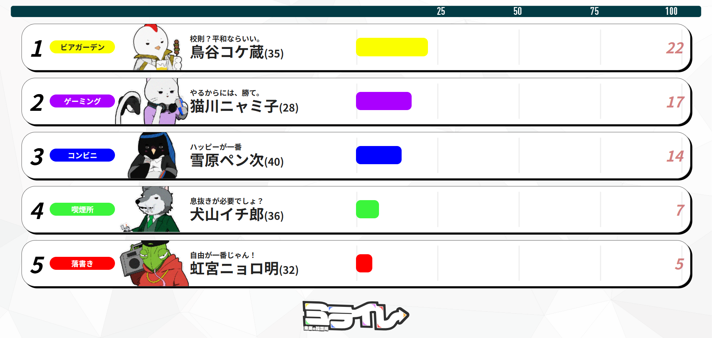

# ミライレ - 未来の投票所 -

## このリポジトリについて
本リポジトリは、専門学校HAL大阪にて行ったチーム制作課題として作成したWebアプリケーションです。  
オンライン投票をテーマに、「投票という行為をより身近に感じられる体験」を目的として制作しました。

---

## 作品概要

- 作品名：ミライレ - 未来の投票所 -
- 制作形態：チーム制作
- 制作内容：オンライン投票を想定したWebアプリケーション

---

## 画面イメージ
※本作品は、2026年1月11日に行われた未来創造展で展示および使用したものであり、画面は一部のみ掲載してます。

### トップページ

### 現在の投票状況を示したインフォグラフィック

---

## 使用技術
- HTML  
- CSS  
- JavaScript  
- PHP  
- SQL  

※PHPは比較的継続して学習・実装しており、  
※JavaScriptおよびSQLは学習開始から約3か月程度です。

---

## 担当箇所
- バックエンド実装を中心に担当
- DB設計の基礎部分の実装
- フロントエンドの一部実装  
  （画面遷移、UIの動き、表示制御など）

---

## 工夫した点
- 投票という行為が直感的に理解できるよう、画面構成や遷移の流れを意識して実装しました。
- 未習範囲については、公式ドキュメントや技術記事を調べながら理解し、実装を進めました。
- チーム制作の中で、役割分担を意識しながら、自身の担当範囲に責任を持って取り組みました。

---

## 現時点での課題・今後の改善点
- エラー処理や入力チェックの強化
- セキュリティ面の理解および実装
- 処理の整理や可読性を意識したコード改善

---

## 補足
本作品は学習目的で制作したものですが、  
展示・発表を想定した作品として取り組みました。  
現在も振り返りを行いながら、改善・学習を継続しています。
